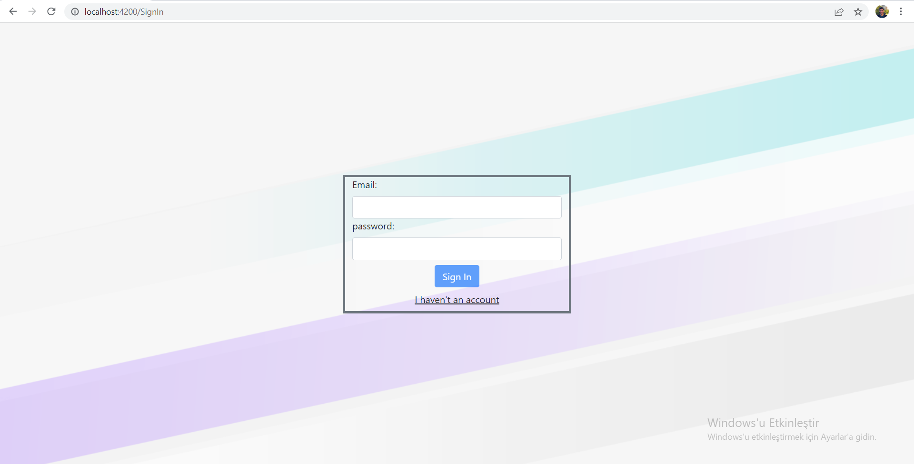
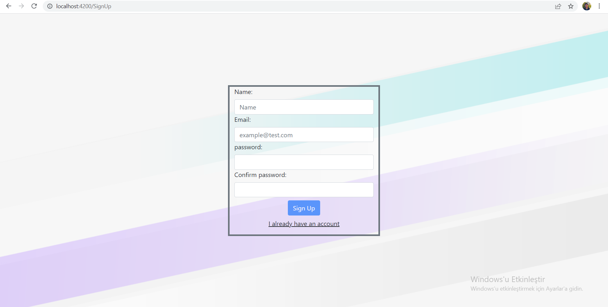
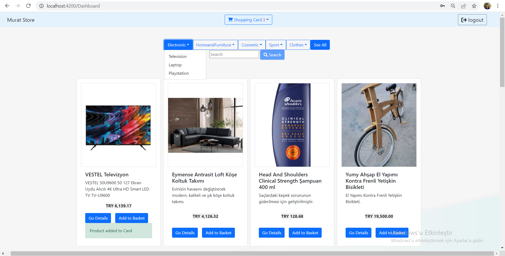
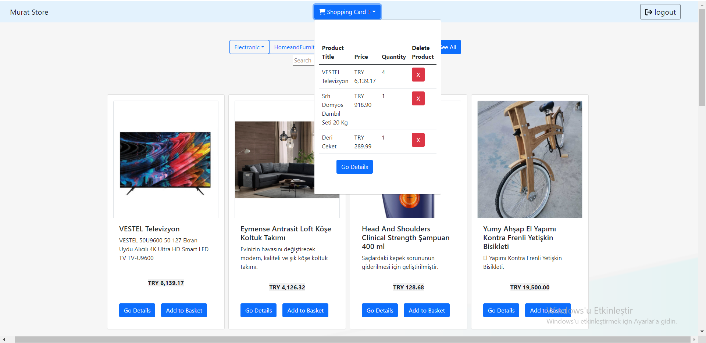
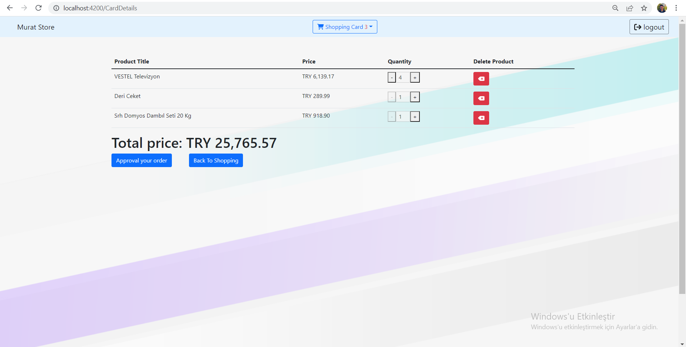
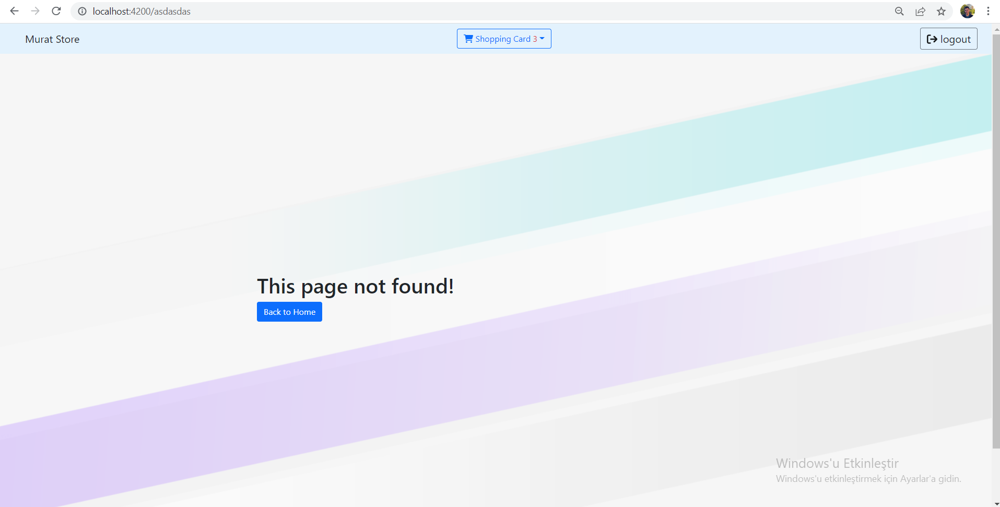

# E-commerce web application with angular

In this project, an e-commerce web application was developed where users can register, login and shop.

# Run Locally

Clone the project

```bash
  git clone https://github.com/164-orion-innovation-turkey-bootcamp/hafta4-odev-assignment-muratceng
```
Install dependencies

```bash
  npm install
```

Start Json-Server

```bash
  npm run start-server
```

Start Server

```bash
  npm run start
```

# Used technologies and extensions

HTML, CSS, Angular, Typescript, Javascript, Bootstrap, Json-server, ng-bootstrap, fontawesome

# Functionalities

• The product card contains the picture, name, description and price of the products.

• On the detail page of the products, there is a larger pictures of the product in carousel, price and a description text.

• Products can be filtered by category.

• There is a text input and products can be filtered by title of product.

• The user cannot see the products without registering and logging into the system.

• If the user enters a meaningless url, they will be redirected to the notfound page.

• The app supports responsive design.


# ScreenShots







